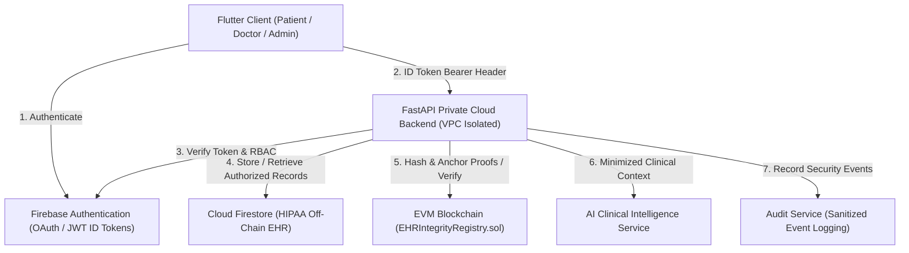

# Full End-to-End System Architecture

**Official Project Title:**  
**AI-Enabled Secure Electronic Health Record Management System with Blockchain and Private Cloud**

---

## 1. Architectural Overview

The system realizes a multi-tiered, privacy-first healthcare management platform integrating:
- **Client Presentation Layer:** Flutter multi-role application (Patient, Doctor, Admin Portals).
- **Authentication & Identity:** Firebase Authentication issuing cryptographically signed JWT ID tokens.
- **Private Cloud Gateway & Services:** FastAPI backend hosted within an isolated AWS VPC / Private Cloud topology.
- **Authoritative Off-Chain EHR Storage:** Cloud Firestore enforcing strict security rules and field validations.
- **Integrity & Immutability Layer:** EVM smart contract (`EHRIntegrityRegistry`) anchoring canonical SHA-256 digests.
- **Assistive AI Clinical Intelligence:** Grounded, data-minimized clinical analysis and health assistant engine.
- **Comprehensive Audit Trail:** Immutable event logger providing tamper-evident audit trails with PII sanitization.

---

## 2. Core Architectural Separation

| Subsystem | Storage Domain | Nature of Data | Security & Access Guardrails |
|---|---|---|---|
| **Patient Portals (Flutter)** | Local Client Cache (Encrypted) | View Models, UI State | Ephemeral, no secret keys or raw blockchain keys |
| **Electronic Health Records** | Cloud Firestore | Full Clinical Records, Notes, Prescriptions | Off-chain only; RBAC & ownership rules in `firestore.rules` |
| **Blockchain Subsystem** | EVM Smart Contract (`py-evm` / Besu) | 32-Byte SHA-256 Hashes, Proof Metadata | Zero PII or medical data on-chain; only deterministic hashes |
| **AI Clinical Assistant** | In-Memory / Stateless | Minimized Clinical Highlights | No PII; strictly non-diagnostic; disclaimers enforced |
| **Audit Subsystem** | Cloud Firestore / Local Log Trail | Sanitized Event Envelopes | Automated redaction of passwords, tokens, and PII |

---

## 3. End-to-End Component Interaction Flow

1. **User Authentication:** Client exchanges credentials with Firebase Auth to obtain a signed JWT ID Token.
2. **Gateway Authorization:** FastAPI decrypts and cryptographically verifies the token via Firebase Admin SDK.
3. **Data Retrieval with Isolation:** Backend retrieves off-chain record from Firestore, ensuring callers cannot access unassigned or unauthorized records.
4. **Integrity Notarization:** Doctor commands an integrity proof creation. Backend normalizes record to canonical JSON, computes a 256-bit SHA-256 hash, and invokes the Solidity contract `storeProof(...)`.
5. **Client Verification:** Patient or clinician initiates verification. Backend re-computes current record hash and compares against smart contract registry:
   - Identical hashes -> `INTEGRITY_VERIFIED`
   - Discrepancy -> `INTEGRITY_MISMATCH` (Tamper Detected)
6. **AI Grounding & Explanation:** Patient asks a health question. Backend minimizes data, compiles safe prompt, runs pharmacology reasoning, verifies safety constraints, and delivers structured advice with mandatory disclaimers.
